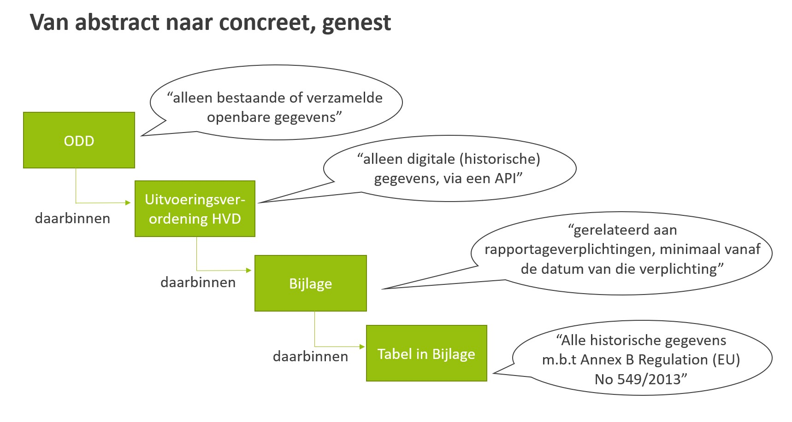

# Toelichting uitvoeringsverordening {#658AA99F}

## Hoe de uitvoeringsverordening te lezen {#6B73DD84}

De uitvoeringsverordening High Value Datasets (HVD) en de bijlage hierin, moeten gelezen worden in het kader van de Open Data richtlijn (ODD) zoals in het onderstaande figuur schematisch en ter illustratie is weergegeven. De vereisten zijn in de Open Data richtlijn abstract, en richting de tabel in de bijlage van de uitvoeringsverordening telkens concreter beschreven. De concrete beschrijvingen in de tabel in de bijlage vallen binnen de abstracte beschrijving van de Open Data richtlijn. 

</img>

## Verbinding met andere Europese richtlijnen {#5A325F91}

De <a href='https://docs.geostandaarden.nl/eu/handreiking-EU-informatie/' target='_blank'>Handreiking EU informatie m.b.t. digitale en data-strategie</a> geeft informatie over de (aankomende) Europese Verordeningen en Richtlijnen rond de Digitale Strategie en de Data Strategie. Hierin is ook een hoofdstuk over de Open Data richtlijn opgenomen en over high value datasets die in deze richtlijn benoemd zijn. 

### INSPIRE richtlijn {#1547CDD1}

De uitvoeringsverordening HVD voegt een open data verplichting toe aan een reeks INSPIRE thema’s (25 van de 34) vallend onder de HVD thema’s Geospatiale data, Aardobservatie en milieu en Mobiliteit. Het betreft hier zowel de geharmoniseerde datasets als de rijkere brondatasets. Bij de implementatie van INSPIRE in Nederland is ervoor gekozen alleen de meest geschikte dataset aan te merken voor INSPIRE. Bij HVD gaat het niet alleen om deze meest geschikte dataset, het gaat ook om de overige datasets die onder de INSPIRE thema’s vallen.

### Verordening inzake Gemeenschappelijk Landbouwbeleid (GLB) {#1BC3F1EC}

Onder het HVD thema Geospatiale data vallen de referentiepercelen en de landbouwpercelen zoals benoemd in de <a href='https://eur-lex.europa.eu/legal-content/NL/TXT/HTML/?uri=CELEX:32013R1306' target='_blank'>Verordening (EU) 1306/2013</a> inzake de financiering, het beheer en de monitoring van het gemeenschappelijk landbouwbeleid (GLB) onder de open data verplichting. 
### Europese richtlijn milieu-informatie {#2406B737}

Onder het HVD thema Aardobservatie en milieu is alle milieu-informatie in scope zoals genoemd in <a href='https://eur-lex.europa.eu/legal-content/NL/TXT/HTML/?uri=CELEX:32003L0004' target='_blank'>Richtlijn 2003/4/EC</a> over publieke toegang tot milieu-informatie. 

### Data ontstaan door monitoring- en rapportageverplichtingen {#1A27368A}

Onder het HVD thema Aardobservatie en milieu is, naast hierboven genoemde data, ook data in scope die door monitoring- en rapportageverplichtingen ontstaat t.a.v. lucht, klimaat, emissies, natuurbehoud en biodiversiteit, geluid, afval, water, milieuaansprakelijkheid en duurzame beleggingen. In de HVD is expliciet benoemd om welke artikelen uit 31 milieu gerelateerde richtlijnen het gaat. In <a href='#x757f4deb'> Bijlage 1</a> is een overzicht opgenomen van alle milieurichtlijnen en een korte toelichting van de genoemde artikelen. 

Het thema Statistiek omvat datasets die ontstaan bij de rapportageverplichtingen op grond van een reeks statistiek gerelateerde richtlijnen en verordeningen.

### Richtlijnen bedrijfsdocumenten en -rekeningen {#7AFE4A28}

Datasets over bedrijfsdocumenten en -rekeningen worden beschreven in <a href='https://eur-lex.europa.eu/legal-content/NL/TXT/HTML/?uri=CELEX:32013L0034' target='_blank'>Richtlijn 2013/34/EU</a> betreffende de jaarlijkse financiële overzichten, geconsolideerde financiële overzichten en aanverwante verslagen van bepaalde ondernemingsvormen, en <a href='https://eur-lex.europa.eu/legal-content/NL/TXT/HTML/?uri=CELEX:32004L0109' target='_blank'>Richtlijn 2004/109/EG</a> betreffende de transparantievereisten die gelden voor informatie over uitgevende instellingen waarvan effecten tot de handel op een gereglementeerde markt zijn toegelaten.

### Richtlijn betreffende binnenwateren {#247BFB0E}

Het thema Mobiliteit omvat, naast INSPIRE data ook statische gegevens, dynamische gegevens en elektronische kaarten en navigatiekaarten voor de binnenvaart, zoals beschreven in <a href='https://eur-lex.europa.eu/legal-content/NL/TXT/HTML/?uri=CELEX:32005L0044' target='_blank'>Richtlijn 2005/44/EG</a> betreffende geharmoniseerde River Information Services (RIS) op de binnenwateren. 

## Historische data {#4CFA719E}

In de uitvoeringsverordening HVD wordt bij drie thema’s ingegaan op historische data. Het betreft de thema’s: 
<ul><li>Aardobservatie en milieu</li>
<li>Meteorologische data</li>
<li>Statistiek</li>
</ul>

Voor de datasets die vallen onder het HVD thema Aardobservatie en milieu is het volgende aangegeven: “<i>De meest recente datasets en de historische versies van datasets die beschikbaar zijn.</i>” Bij het HVD thema Meteorologische data staat bij de klimaatgegevens, Gevalideerde observaties: “<i>Alle gedigitaliseerde historische gegevens</i>”. Het HVD thema Statistiek gaat uit van “<i>De tijdsreeksen beginnen uiterlijk op de datum van toepassing van de desbetreffende rechtshandeling die in de tabel is opgenomen</i>”. 

Bij datasets met meetreeksen kan, na afsluiting van een jaar, de data van dat jaar als historische data worden gezien. Bij data waarbij de situatie op een bepaald moment verandert, is de vraag of elke verandering een historische dataset oplevert of dat bij elke verandering een wijzigingsdatum wordt meegegeven en dan per jaar worden opgeslagen. Daarmee wordt ook een historie opgebouwd.  

De Commissie heeft aangegeven (d.d. 8 november 2022) dat de benadering van historische gegevens waarschijnlijk per sector/thema zal verschillen. Mogelijk verschilt de benadering ook tussen lidstaten binnen één sector, aangezien de uitvoeringsverordening tot doel heeft de manier waarop relevante overheidsinstanties hun gegevens beheren niet te verstoren. Verschillende fora van relevante sectorale deskundigen zijn een goede ingang om aan te dringen op een meer geharmoniseerde aanpak in de gegeven sectoren. 

Bij het HVD thema Statistiek wordt uitgegaan van de vereisten zoals genoemd in de desbetreffende wetgeving en een startdatum voor tijdsreeksen uiterlijk op de datum waarop deze van toepassing is. Advies is om deze vereisten te volgen, en indien machine leesbare gegevens die verder teruggaan voorhanden zijn, ook die beschikbaar te stellen. 

Voor de gevalideerde klimaat observaties uit het HVD-thema Meteorologische data en het HVD-thema Aardobservatie en milieu zijn geen wettelijke kaders gegeven. Aangezien het beheer van de gegevens door de overheidsinstanties verschillend is en niet aangepast hoeft te worden, kan de data op eenzelfde manier worden ontsloten als in de lidstaat wordt gedaan. Daarbij wordt geadviseerd om voor het thema Aardobservatie en milieu wel overeenstemming te bereiken op EU-niveau om hergebruik gemakkelijker te maken.

## Schaalniveau/resolutie {#3357033D}

Bij vier van de zes thema’s beschreven in de uitvoeringsverordening HVD zijn verschillende schaalniveaus vereist. Het betreft de HVD thema’s:  
<ul><li>Geospatiale data</li>
<li>Aardobservatie en milieu</li>
<li>Mobiliteit - Vervoersnetwerken</li>  
<li>Meteorologische data</li>
</ul>

Voor de meeste datasets van de HVD thema’s Geospatiale data, Aardobservatie en milieu, en het subthema Vervoersnetwerken van het thema Mobiliteit, geldt: alle generalisatieniveaus die beschikbaar zijn tot de schaal van 1 op 5 000. Daarbij staat het volgende nog aanvullend aangegeven: In het geval datasets niet beschikbaar zijn op de in de bijlage van de uitvoeringsverordening HVD vermelde schaal, maar wel in (een) hogere ruimtelijke resolutie(s), moeten zij worden verstrekt in de beschikbare ruimtelijke resolutie. 

Voor HVD thema Meteorologische data geldt bij 1 subthema, namelijk gegevens uit modellen inzake numerieke weersverwachting (NWP-model), een resolutie vereiste. Ook hier is opgenomen dat indien het vereiste rasterniveau van 2,5 km niet gehaald kan worden, het best beschikbare raster gebruikt moet worden.

## Persoonsgegevens {#5D2970DF}

Wanneer de beschikbaarstelling van HVD voor hergebruik gepaard gaat met de verwerking van persoonsgegevens, moet die verwerking plaatsvinden in overeenstemming met het Unierecht betreffende de bescherming van natuurlijke personen in verband met de verwerking van persoonsgegevens, met name <a href='https://eur-lex.europa.eu/legal-content/NL/TXT/HTML/?uri=CELEX:32016R0679'>Verordening (EU) 2016/679</a> van het Europees Parlement en de Raad (AVG). Dit geldt ook voor alle bepalingen van intern recht waarin de toepassing van de AVG nader wordt gespecificeerd. Wanneer dit het geval is, moeten passende methoden en technieken (zoals generalisatie, aggregatie, onderdrukking, anonimisering, differentiële privacy of randomisering) toegepast worden om zoveel mogelijk gegevens beschikbaar te stellen voor hergebruik.

